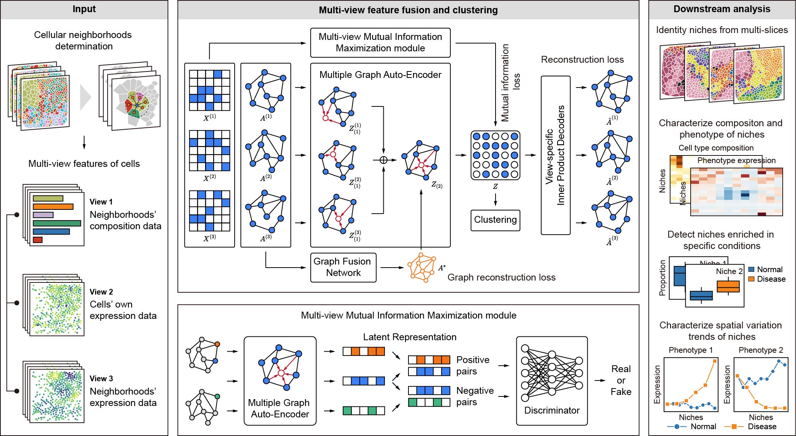

# scNiche v1.0.0

## Identification and characterization of cell niches in tissue from spatial omics data at single-cell resolution

[](https://www.python.org/) 

scNiche is a computational framework to identify and characterize cell niches from single-cell spatial omics data



## Requirements and Installation
[](https://pypi.org/project/anndata/) [](https://pypi.org/project/pandas/) [](https://pypi.org/project/squidpy/) [](https://github.com/scverse/scanpy) [](https://www.dgl.ai/)  [](https://pytorch.org/get-started/locally/) [](https://pypi.org/project/matplotlib/) [](https://pypi.org/project/seaborn/) 

### Create and activate Python environment
For scNiche, the Python version need is over 3.9. If you have already installed a lower version of Python, consider installing Anaconda, and then you can create a new environment.
```
conda create -n scniche python=3.9
conda activate scniche
```

### Install PyTorch and DGL
We developed scNiche in a CUDA 11.3 environment. Here is an example of installing PyTorch and DGL with CUDA11.3:
```
# install PyTorch
pip install torch==1.12.1+cu113 --extra-index-url https://download.pytorch.org/whl/cu113

# install DGL
pip install dgl==1.1.0+cu113 -f https://data.dgl.ai/wheels/cu113/repo.html
```
The version of PyTorch and DGL should be suitable to the CUDA version of your machine. You can find the appropriate version on the [PyTorch](https://pytorch.org/get-started/locally/) and [DGL](https://www.dgl.ai/) website.

### Install other requirements
```
cd scNiche-main
pip install -r requirements.txt
```
### Install scNiche
```
python setup.py build
python setup.py install
```

## Tutorials (identify cell niches)
scNiche requires the single-cell spatial omics data (stored as `.h5ad` format) as input, where cell population label of each cell needs to be provided.

Here are examples of scNiche on simulated and biological datasets:
* [Demonstration of scNiche on the simulated data](tutorial/tutorial_simulated.ipynb)
* [Demonstration of scNiche on the mouse spleen CODEX data](tutorial/tutorial_spleen.ipynb)
* [Demonstration of scNiche on the human upper tract urothelial carcinoma (UTUC) IMC data](tutorial/tutorial_utuc.ipynb)

## Tutorials (characterize cell niches)
scNiche also offers a downstream analytical framework for characterizing cell niches more comprehensively.

Here are examples of scNiche on two biological datasets:
* [Demonstration of scNiche on the human triple-negative breast cancer (TNBC) MIBI-TOF data](tutorial/tutorial_tnbc.ipynb)
* [Demonstration of scNiche on the mouse liver Seq-Scope data](tutorial/tutorial_liver.ipynb)


## About
scNiche was developed by Jingyang Qian. Should you have any questions, please contact Jingyang Qian at qianjingyang@zju.edu.cn.

